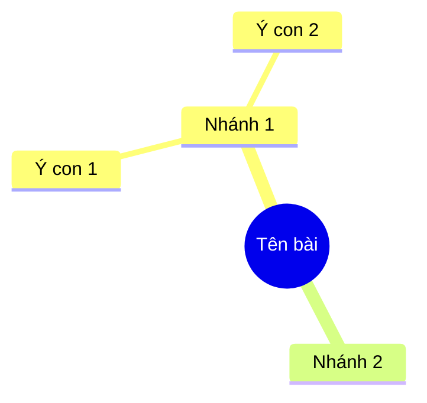

# Sơ đồ dạy học

Sơ đồ dùng để **hệ thống hoá kiến thức** (ôn tập, tổng kết chương) hoặc **chỉ tiến trình** (các bước của
một quá trình, quy trình). Khác với `ve-hinh-giao-khoa` (hình chính xác theo toán/lý/hoá/sinh), skill này
lo sơ đồ **tổ chức thông tin**.

## Trước khi vẽ: chọn đúng loại sơ đồ

Chọn sai loại là lỗi hay gặp nhất — sơ đồ đẹp nhưng không giúp học sinh hiểu gì thêm.

| Mục đích | Loại sơ đồ | Khi nào |
|---|---|---|
| Hệ thống hoá kiến thức một bài/chương | **Sơ đồ tư duy** (mindmap) | Cuối bài, ôn tập chương; quan hệ là "thuộc về / gồm các ý" |
| Chỉ các bước của một quá trình | **Sơ đồ khối tuần tự** | Quy trình, thí nghiệm, thuật toán, các bước giải |
| Làm rõ quan hệ giữa các khái niệm | **Sơ đồ khái niệm** (có mũi tên có nhãn) | Quan hệ nhân–quả, phụ thuộc, ảnh hưởng |
| So sánh hai hay nhiều đối tượng | **Bảng so sánh** (KHÔNG phải sơ đồ) | So sánh là bảng, vẽ sơ đồ sẽ rối |
| Diễn biến theo thời gian | **Trục thời gian** | Lịch sử, tiến trình phát triển |
| Phân loại | **Sơ đồ cây** | Phân loại sinh vật, phân loại chất, các loại câu |

**Không dùng sơ đồ tư duy cho nội dung tuần tự** — não đọc sơ đồ tư duy theo nhóm, không theo thứ tự bước.
Ngược lại, đừng dùng sơ đồ khối cho nội dung phân nhánh.

## Quy trình (4 bước)

1. **Xác định nội dung cần sơ đồ hoá** — bài nào, mục nào, dùng vào lúc nào (đầu bài / củng cố / ôn tập).
   Tra Kho tri thức AI (`tt_bai`) hoặc SGK để lấy **đúng cấu trúc bài** — sơ đồ phải phản ánh cấu trúc thật
   của bài, không phải cấu trúc do mình tự nghĩ ra.
2. **Rút ra cấu trúc**: xác định các nhánh/khối và quan hệ giữa chúng. Kiểm: bỏ sơ đồ đi, học sinh có mất
   một ý quan trọng không? Nếu không mất gì thì sơ đồ đang thừa.
3. **Vẽ** theo khuôn ở mục dưới. Ưu tiên **SVG** nếu chèn vào Word/PowerPoint; dùng **Mermaid** khi cần nhanh
   và chỉ để xem trên màn hình.
4. **Tự kiểm** bằng bảng kiểm cuối bài, rồi lưu `SO DO/<Môn>/SoDo_<tên-bài>.svg` + `.png`.

## Khuôn vẽ

### Sơ đồ tư duy — SVG, bố trí toả tròn

```svg
<svg xmlns="http://www.w3.org/2000/svg" viewBox="0 0 600 400" font-family="'Times New Roman',serif" font-size="13">
  <rect width="600" height="400" fill="#fff"/>
  <g stroke="#000" stroke-width="1.4" fill="none">
    <path d="M300,200 C240,200 220,120 160,110"/>
    <path d="M300,200 C240,200 220,290 160,300"/>
    <path d="M300,200 C360,200 380,120 440,110"/>
    <path d="M300,200 C360,200 380,290 440,300"/>
  </g>
  <ellipse cx="300" cy="200" rx="72" ry="26" fill="#F7E9E1" stroke="#9C4420" stroke-width="1.6"/>
  <text x="300" y="205" text-anchor="middle" font-weight="600">TÊN BÀI</text>
  <g fill="none" stroke="#000" stroke-width="1.2">
    <rect x="96" y="92" width="128" height="34" rx="6"/>
    <rect x="96" y="283" width="128" height="34" rx="6"/>
    <rect x="376" y="92" width="128" height="34" rx="6"/>
    <rect x="376" y="283" width="128" height="34" rx="6"/>
  </g>
  <g text-anchor="middle">
    <text x="160" y="113">Nhánh 1</text>
    <text x="160" y="304">Nhánh 2</text>
    <text x="440" y="113">Nhánh 3</text>
    <text x="440" y="304">Nhánh 4</text>
  </g>
</svg>
```

**Quy tắc bố trí:** nhánh **≤ 6** (nhiều hơn thì tách thành 2 sơ đồ); nhánh dài thì dùng `path` cong chứ
không vẽ đường gấp khúc; chữ trong ô **≤ 4 từ**, chi tiết đưa xuống nhánh con.

### Sơ đồ khối tuần tự

```svg
<!-- mỗi khối: rect + mũi tên xuống; dùng chung marker như ve-hinh-giao-khoa -->
<rect x="200" y="40" width="180" height="44" rx="8" fill="#F7E9E1" stroke="#9C4420"/>
<text x="290" y="67" text-anchor="middle">Bước 1 — …</text>
<line x1="290" y1="84" x2="290" y2="112" marker-end="url(#mt)"/>
<rect x="200" y="116" width="180" height="44" rx="8" fill="#fff" stroke="#000"/>
<text x="290" y="143" text-anchor="middle">Bước 2 — …</text>
```

Khối **quyết định** (rẽ nhánh) vẽ hình thoi; nhánh "đúng/sai" ghi nhãn trên mũi tên.

### Mermaid — khi chỉ cần nhanh

````

````

Mermaid hiển thị tốt khi xem trên màn hình nhưng **khó chèn vào Word** — muốn in thì vẫn phải chuyển SVG/PNG.

## Nguyên tắc sư phạm

- **Từ khoá, không phải câu.** Ô sơ đồ ghi 2–4 từ; học sinh nhìn là nhớ, không phải đọc.
- **Một sơ đồ một tầng ý.** Sơ đồ tư duy sâu quá 3 tầng thì học sinh không theo được — tách sơ đồ.
- **Đúng cấu trúc SGK**: nhánh lớn phải khớp mục lớn của bài. Sơ đồ lệch cấu trúc sách làm học sinh rối khi
  đối chiếu.
- **Không đưa chi tiết không có trong bài** — sơ đồ ôn tập chỉ chứa cái đã học.
- **Sơ đồ cho học sinh tự điền**: nếu dùng làm phiếu, để trống một số ô cho học sinh viết (dùng
  `phieu-hoc-tap` để làm bản phát tay).
- **Màu chỉ để phân nhóm**, và phải phân biệt được khi in đen trắng (dùng nét đậm/nhạt, hoa văn).

## Bảng kiểm trước khi giao

1. Loại sơ đồ có khớp mục đích không (tuần tự vs phân nhánh vs so sánh)?
2. Nhánh/khối có khớp cấu trúc bài trong SGK không?
3. Chữ trong ô có ≤ 4 từ không? Số tầng có ≤ 3 không?
4. Bỏ sơ đồ đi có mất ý quan trọng không (nếu không mất thì sơ đồ thừa)?
5. In đen trắng còn phân biệt được các nhóm không?
6. Đã xuất cả `.svg` (nguồn) và `.png` (để chèn) chưa?

## Liên kết skill khác

- `ve-hinh-giao-khoa` — hình chính xác theo toán/lý/hoá/sinh (khác skill này).
- `soan-bai-trinh-chieu` · `phieu-hoc-tap` · `soan-ke-hoach-bai-day` — nơi dùng sơ đồ.
- `docx` · `pptx` — chèn sơ đồ vào sản phẩm.
